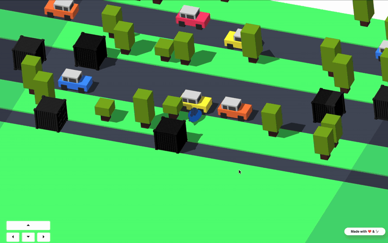

# Crossy Whale



A browser-based Crossy Road clone starring the Docker whale, built to demonstrate how Docker's core technologies work together in a real application.

## What you will learn

Working through this repository you will encounter six Docker technologies in a real codebase:

1. **Docker Compose** — define and run a multi-service application with a single command
2. **Dockerfile & multi-stage builds** — compile a Go binary and produce a lean, production-ready image
3. **Docker Hardened Images (DHI)** — use security-hardened base images from `dhi.io` to reduce your attack surface
4. **Testcontainers** — run real Docker containers as part of your Go test suite, eliminating mock/production drift
5. **Dev Containers** — define your entire development environment as code, so any developer gets the same toolchain instantly
6. **Kubernetes** — deploy the running application to a local Kubernetes cluster using a Helm chart

---

## Run the app

**Prerequisites:**

- [Docker Desktop](https://www.docker.com/products/docker-desktop/) (or Docker Engine + Compose v2). Nothing else to install.
- A free [Docker account](https://hub.docker.com/signup) and a one-time login to the DHI registry, since the app and Redis run on hardened base images:

  ```bash
  docker login dhi.io        # use your free Docker ID; DHI Community images are free to pull
  ```

Start everything:

```bash
docker compose up -d
```

Open <http://localhost:8080/> — a landing page appears linking to `/play` (the game), `/host` (the QR code presenter view), and `/leaderboard` (the wall display). That's it: one command started three services (Redis, the Go app, and optionally ngrok) and wired them together.

Stop with:

```bash
docker compose down
```

Docker Compose just orchestrated all of that. The next section shows how.

---

## Understanding Docker Compose

Open [`docker-compose.yml`](docker-compose.yml).

**What Docker Compose does**: a single `docker-compose.yml` file declares every service your application needs — what image to use, what ports to expose, what environment variables to set, and how services depend on each other. `docker compose up` reads that file and starts everything.

**The three services**: this project defines `redis`, `app`, and `ngrok`. Look at the top of the file to see them listed under `services:`.

**How services discover each other**: find `REDIS_ADDR=redis:6379` in the `app` service's `environment:` block. The value `redis` is not a hostname you configured — it is the name of the service in this file. Docker Compose automatically provides DNS so every service can reach any other by its service name. No hard-coded IP addresses needed.

**`expose:` vs `ports:`**: the `redis` service uses `expose: "6379"`. This makes the port reachable to other services on the internal Compose network, but not to your host machine. The `app` service uses `ports: "8080:8080"`, which publishes the container port to your host so you can open it in a browser.

**Environment variables as configuration**: every runtime setting (secrets, addresses, TTLs) is passed to the `app` container via `environment:`. Values that aren't set in `.env` fall back to safe development defaults. This is how twelve-factor apps are configured.

**Profiles for optional services**: the `ngrok` service has `profiles: [public]`. It only starts when you add `--profile public` to the compose command. Profiles let you keep optional or environment-specific services in the same file without starting them by default.

---

## Understanding the Dockerfile

Open [`app/Dockerfile`](app/Dockerfile).

**Multi-stage builds**: the Dockerfile has two stages. The first (`AS build`) uses a full Go toolchain image to compile the binary. The second (final) stage starts from a minimal base image and copies in only the compiled binary and the frontend assets. The Go compiler, source code, and all build tools are left behind — they never appear in the final image. The result is a smaller, more secure image with no build-time dependencies present at runtime.

**Docker Hardened Images**: both base images start with `dhi.io/`. These are pulled from Docker's DHI registry, which provides hardened versions of common base images. Compared to their Docker Hub equivalents, DHI images are built from minimal foundations with known-good package versions and are regularly updated. Using them reduces the attack surface of every container you ship.

Look at the final `FROM` line — `dhi.io/static` is a near-empty image designed for running statically compiled binaries. The entire production image contains only what the app needs to run.

---

## Understanding Testcontainers

Open [`app/internal/gate/window_test.go`](app/internal/gate/window_test.go) and find the `newTestRedisStore` function.

**What Testcontainers does**: Testcontainers-go is a Go library that starts real Docker containers as part of a test. Each call to `tcredis.Run()` pulls the Redis image, starts a container, maps a random port, and returns a handle. When the test ends, the container is automatically stopped and removed.

**Why a real container instead of a mock**: a mock Redis client can be programmed to return the right answers, but it cannot reproduce actual Redis behaviour — TTL expiry timing, stream semantics, command argument expectations. Tests that passed against a mock have broken in production when Redis behaviour differed in subtle ways. A real container gives the same confidence as a production deployment at the cost of a few extra seconds per test run.

For a second example, open [`app/internal/leaderboard/store_test.go`](app/internal/leaderboard/store_test.go) — the same pattern tests the leaderboard's Redis Stream operations.

For the interface design that makes this possible (tests use a fast in-memory fake; only the Redis implementation tests use Testcontainers), look at [`app/internal/gate/window.go`](app/internal/gate/window.go) and the `WindowStore` interface comment.

---

## Developing inside a Dev Container

**What a dev container is**: a dev container is a Docker container that *is* your development environment. The toolchain, extensions, and configuration are defined in `.devcontainer/` as code, so every developer — and every CI run — gets the same environment without any host-side installs beyond Docker Desktop.

VS Code with the [Dev Containers extension](https://marketplace.visualstudio.com/items?itemName=ms-vscode-remote.remote-containers) is the recommended local development environment. Opening the project in a dev container gives you a fully-equipped Go 1.25 workspace instantly.

**Prerequisites**: Docker Desktop running on the host, VS Code, Dev Containers extension installed.

**Open in one step**: open the repo folder in VS Code, then when prompted click **Reopen in Container** (or use the Command Palette: `Dev Containers: Reopen in Container`). The first build takes a few minutes; subsequent opens are instant.

**What you get inside the container**:

- Go 1.25 toolchain — `go build ./...` and `go test ./...` work immediately
- Docker CLI connected to the host daemon — `docker compose up` runs the full app stack from inside the container; the game is accessible in your host browser at <http://localhost:8080>
- Testcontainers-based integration tests work — the Go tests that spin up a real Redis container (`internal/leaderboard/`, `internal/gate/`) pass inside the dev container, no extra setup required
- Go editor intelligence — autocomplete, go-to-definition, inline errors, and auto-format on save via the official Go extension

**Full validation walkthrough**: [`specs/006-dev-container-support/quickstart.md`](specs/006-dev-container-support/quickstart.md)

---

## Deploying to Kubernetes

Kubernetes is a container orchestration system: it runs containers across one or more machines and handles restarts, scaling, and networking. This project includes a Helm chart in `k8s/` — Helm is a package manager for Kubernetes that lets you install and uninstall an application with a single command.

Docker Desktop's built-in Kubernetes (Settings → Kubernetes → Enable Kubernetes) gives you a local single-node cluster with no extra infrastructure.

See [`k8s/README.md`](k8s/README.md) for the full deployment commands (install, access via port-forward, uninstall).

---

## What you learned

By working through this repository, you have seen:

- **Docker Compose** defines a multi-service application as a single file. One command starts every service, wires the network, and sets environment variables. Service names act as DNS hostnames so containers find each other without hard-coded IPs.
- **Multi-stage Dockerfiles** separate build-time tools from the runtime image, producing a smaller, more secure final image. Only the compiled binary and assets are shipped.
- **Docker Hardened Images** are security-hardened base images available from `dhi.io`. They reduce your attack surface without changing how you write your Dockerfile.
- **Testcontainers** lets Go tests start real Docker containers on demand. Tests run against the same Redis version and configuration as production, catching bugs that mocks cannot.
- **Dev Containers** package the full development environment — toolchain, editor extensions, runtime — as a Docker container defined in code. Any developer gets the same setup instantly.
- **Kubernetes** orchestrates containers in production. A Helm chart describes the deployment; Docker Desktop provides a local cluster to try it on.

---

## Make it publicly accessible (optional)

Sharing a public URL (for attendees to join over wifi/cellular) needs a free [ngrok](https://ngrok.com) account and its authtoken. Note that `ngrok/ngrok:3` is the one image **not** migrated to Docker Hardened Images — no hardened equivalent exists, and it only runs in this optional `public` profile:

```bash
cp .env.example .env           # once
# edit .env and set NGROK_AUTHTOKEN=<your token>
docker compose --profile public up -d
open http://localhost:8080/host   # shows the current QR code, with a button to rotate it
```

**Inspecting the tunnel**: ngrok's local web inspector — the current public URL plus a live request log — is served at <http://localhost:4040> while the `public` profile is running.

The public URL only serves the game to a visitor who has scanned the current QR code — anyone else sees a "scan the QR code to play" message. Display `/host` on a presenter-only screen: the QR code and its "Rotate" button are not exposed on the public endpoint. Local play at `localhost:8080/play` keeps working even if the tunnel is down.

---

## Leaderboard scores

Before playing, each player enters a display name. On death, their score is shown on a "Game Over" screen and submitted to a Redis-backed leaderboard automatically. A "Replay" button restarts immediately, reusing the same name. Score writes are protected by `LEADERBOARD_API_SECRET` (set in `.env`, injected into the served game page automatically), so only the game client itself can record a score.

Current standings are visible at `http://localhost:8080/leaderboard` — a wall/booth display that refreshes itself automatically as new scores come in.

---

## Troubleshooting

- **Port 8080 already in use**: `docker compose up` fails with "port is already allocated". Stop whatever's using it, or set a different `WEB_PORT` in `.env` and retry.
- **`/qr.png` returns 503**: no QR code has been generated yet (visit `/host` first) or, once public access is enabled, the public URL isn't available yet — check `docker compose --profile public ps` and `NGROK_AUTHTOKEN` in `.env`.
- **Scanned QR code doesn't work anymore**: it may have expired (default 15 minutes, `QR_WINDOW_TTL` in `.env`) or been rotated from `/host` — get the current code and re-scan.
- **Redis errors (`/host` → 503, leaderboard → "failed to load standings", `DENIED Redis is running in protected mode`)**: the Docker Hardened Images Redis ships with `protected-mode` **on**, which rejects connections from other containers. This project disables it in `docker-compose.yml`. If you see these errors, that override is missing or was edited out. Full explanation: [`specs/005-dhi-image-migration/contracts/image-inventory.md`](specs/005-dhi-image-migration/contracts/image-inventory.md#known-configuration-difference-dhi-redis-enables-protected-mode).

Full validation walkthroughs are in
[`specs/001-host-webapp-ngrok/quickstart.md`](specs/001-host-webapp-ngrok/quickstart.md) (local + public hosting),
[`specs/002-qr-gated-access/quickstart.md`](specs/002-qr-gated-access/quickstart.md) (the QR gate),
[`specs/003-leaderboard-score-submission/quickstart.md`](specs/003-leaderboard-score-submission/quickstart.md) (name entry, Game Over, score submission), and
[`specs/004-leaderboard-page/quickstart.md`](specs/004-leaderboard-page/quickstart.md) (the `/leaderboard` wall display).

---

## Optional: Develop with Claude Code (advanced)

This repo is set up so that typing `claude` inside it launches a Claude Code session **inside a Docker sbx sandbox**, with:

- `--dangerously-skip-permissions` mode on (safe because the whole process is sandboxed)
- Two MCP servers pre-loaded via the hosted Docker MCP gateway: `github`, `context7`
- Your host `gh` token forwarded into the sandbox via `sbx secret set -g github`
- A status line showing model, directory, git branch, and context usage

### Quick start (if you've onboarded before)

```bash
cd <this-repo>
claude
```

That's it. `.envrc` puts `./bin` on PATH, so the `claude` command resolves to the wrapper in `bin/claude`, which launches the sandbox for you.

### First time here

Run the onboarding walkthrough. It checks every prerequisite, prints ✓ or ✗ next to each, and gives you the exact command to fix anything that's red:

```bash
./bin/onboard
```

Fix each ✗ (usually one `brew install` or one `export`), re-run `./bin/onboard`, and repeat until everything is green. Then run `claude`.

### What onboard checks

| Group | Checks |
| --- | --- |
| Tools | `sbx`, `gh`, `direnv`, `node`/`npx` |
| Sign-ins | `gh` authenticated |
| Environment | `SBX_MCP_URL`, `GITHUB_TOKEN` exported |
| direnv | Hooked into your shell, `.envrc` allowed |
| MCP | `github` and `context7` registered with sbx |

### What's in this repo

| File | Purpose |
| --- | --- |
| `bin/claude` | Wrapper that launches Claude inside sbx with the right flags and MCP set |
| `bin/onboard` | Idempotent walkthrough. Run this first, and any time something breaks |
| `bin/setup-mcp` | Registers `github` and `context7` MCP servers with sbx (one-off, per machine) |
| `.envrc` | Adds `./bin` to PATH inside this repo (via direnv), sources `.envrc.local` if present |
| `.claude/settings.json` | Wires the status line |
| `.claude/statusline.sh` | Renders the status line output |

### Common tasks

**Rotate your GitHub token.** `sbx secret set -g github` values are picked up at sandbox *creation*, not on every `claude` launch. If your token changes mid-session, remove the sandbox and re-launch:

```bash
sbx rm claude-sandboxes    # default sandbox name; check with `sbx ls`
claude
```

**Change the MCP server set.** Edit `bin/setup-mcp` to add or remove servers, re-run it, then update `--static-mcp github,context7` in `bin/claude` to match. Static mode is fixed at sandbox creation, so also `sbx rm` any existing sandbox.

**Skip the sandbox for one-off work.** The wrapper is only active while direnv has this directory loaded. Outside the repo, `claude` runs your normal host binary.

### How the pieces fit

```
$ claude
    │
    │ (direnv has ./bin on PATH inside this repo)
    ▼
bin/claude
    │
    ├── preflight: sbx installed? SBX_MCP_URL set? MCP servers registered?
    │       └── any ✗ → prints "run ./bin/onboard" and exits
    │
    ├── echo "$(gh auth token)" | sbx secret set -g github
    │
    └── exec sbx run claude --static-mcp github,context7
```

Inside the sandbox, Claude Code sees `.claude/settings.json` (status line), the two MCP servers are pre-loaded, and `gh` inside the sandbox uses the token you forwarded.

---

## References

- Docker Sandboxes: <https://docs.docker.com/ai/sandboxes/>
- Claude Code inside sbx: <https://docs.docker.com/ai/sandboxes/agents/claude-code/>
- direnv: <https://direnv.net/>
