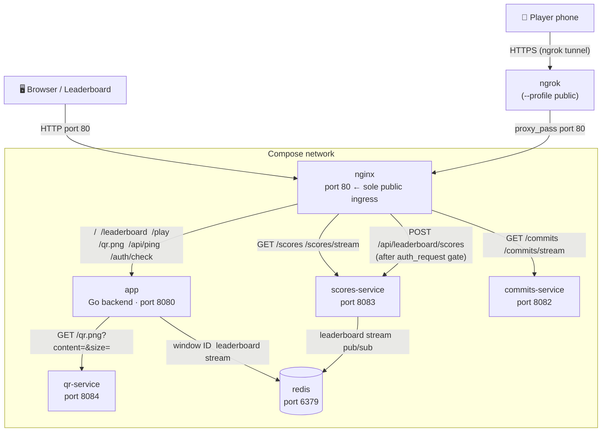
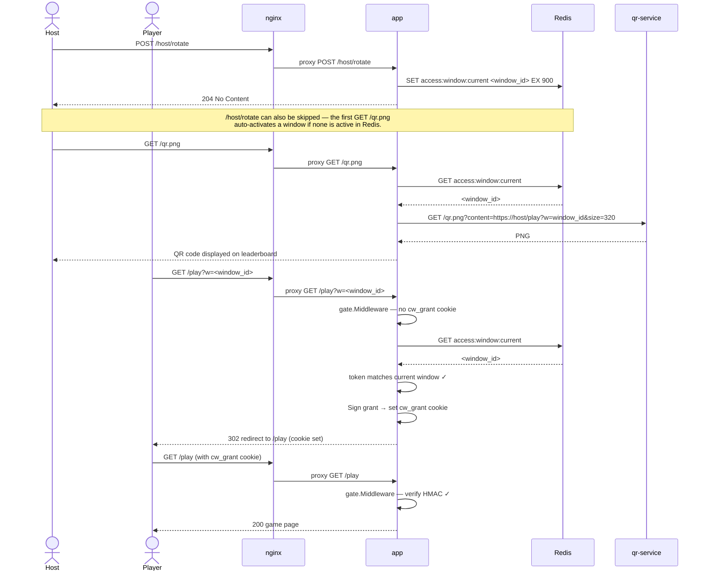
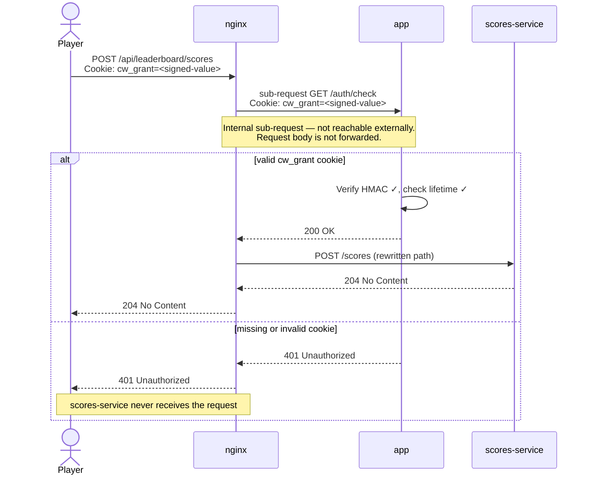

# Architecture

Crossy Whale is a demo-booth game stack running entirely in Docker Compose. Players scan a QR code with their phones to play a browser game; their scores stream live to a projected leaderboard. The host machine runs everything; an optional ngrok tunnel makes the game reachable over the internet.

## Service topology



> **Port exposure policy** — only `nginx:80` and `app:8080` are published to the host. All microservices (`scores-service`, `commits-service`, `qr-service`, `redis`) use `expose:`, making them reachable only within the Compose network. This ensures all external traffic passes through nginx, which is where authentication is enforced.

---

## Services

| Service | Image | Port | Role |
|---------|-------|------|------|
| `nginx` | `whale-runner-nginx:local` | **80** (host) | Single public ingress. Serves static game assets from the image; reverse-proxies all dynamic paths. Enforces score-submission auth via `auth_request`. |
| `app` | `whale-runner:k8s-local` | **8080** (host, dev access) | Go backend. Renders pages, manages the QR window, handles the play gate, validates grant cookies, issues QR codes via qr-service. |
| `scores-service` | `whale-runner-scores:local` | 8083 (internal only) | Reads the leaderboard Redis Stream; serves standings as JSON and live updates as SSE. Accepts score submissions on `POST /scores`. |
| `commits-service` | `whale-runner-commits:local` | 8082 (internal only) | Reads the repo's `.git` history; serves recent commits as JSON and SSE. |
| `qr-service` | `whale-runner-qr:local` | 8084 (internal only) | Renders QR code PNGs on demand. Called only by `app`; not browser-visible. |
| `redis` | `dhi.io/redis:8-alpine` | 6379 (internal only) | Stores the active QR window ID (string key with TTL) and the leaderboard (Redis Stream + pub/sub). |
| `ngrok` | `ngrok/ngrok:3` | 4040 (host, inspection UI) | Optional (`--profile public`). Creates a public HTTPS tunnel to `nginx:80` so players can reach the game via QR code from outside the local network. |

---

## Request routing

| Path | Method | Handler | Auth |
|------|--------|---------|------|
| `/` | GET | `app` | None — getting-started page |
| `/leaderboard` | GET | `app` | None — leaderboard page |
| `/play` | GET | `app` | **QR gate** — `cw_grant` cookie or valid `?w=` token required |
| `/play-local` | GET | `app` | None — mints a grant directly for presenter convenience |
| `/qr.png` | GET | `app` | None — current QR code PNG |
| `/repo-qr.png` | GET | `app` | None — static repo URL QR code |
| `/host/rotate` | POST | `app` | None — rotates the active QR window |
| `/api/ping` | GET | `app` | None — live-reload ping |
| `/auth/check` | GET | `app` | Internal only (nginx sub-request) |
| `/scores` | GET | `scores-service` | None — leaderboard JSON |
| `/scores/stream` | GET | `scores-service` | None — leaderboard SSE |
| `/api/leaderboard/scores` | POST | `scores-service` | **`auth_request` gate** — `cw_grant` cookie required |
| `/commits` | GET | `commits-service` | None — commits JSON |
| `/commits/stream` | GET | `commits-service` | None — commits SSE |
| `/*` | GET | `nginx` (static files) | None — game assets baked into the image |

---

## Authentication

There are two distinct auth mechanisms: the **QR play gate** (controls who can play the game) and the **score submission gate** (prevents fake scores). Both are enforced by the `app` service's cryptographic logic; nginx is the enforcement point for score submission.

### Concepts

**QR window** — a random, opaque token stored in Redis under the key `access:window:current` with a configurable TTL (default 15 minutes). Activating a new window invalidates the previous one immediately. The window ID is baked into the QR code URL as `?w=<window_id>`.

**`cw_grant` cookie** — an HMAC-SHA256-signed cookie issued to a player who successfully presents a valid window token. The cookie payload is:

```json
{
  "grant_id": "<uuid>",
  "issued_window_id": "<window_id that was current at issue time>",
  "issued_at": "<RFC3339 timestamp>"
}
```

The payload is base64url-encoded, then a SHA-256 HMAC (keyed on `GRANT_COOKIE_SECRET`) of the encoded payload is appended after a `.`. The server verifies the HMAC before trusting any cookie value. A grant is valid for 4 hours regardless of whether the originating window has since rotated or expired.

Cookies issued by `gate.Middleware` (the `/play` path) carry `Secure; HttpOnly; SameSite=Lax; MaxAge=<grant-lifetime>`. The `/play-local` shortcut issues the same cookie but **without `Secure`** and without `MaxAge` — intentional, since `/play-local` is only used over plain HTTP on localhost where the `Secure` flag would prevent delivery.

---

### Player access flow (QR gate)



**Rejection cases** — if the player has no cookie and no `?w=` token, or if the token doesn't match the current window (expired, stale QR code, wrong link), gate.Middleware returns **403** with a "Scan the QR code to play" page. No information about why the check failed is revealed to the client.

---

### Score submission flow (auth_request gate)

Score submission goes through a two-stage nginx check before ever reaching `scores-service`. The scores microservice itself has no auth logic — the gate is entirely in nginx + app.



The `location = /auth/check` block in nginx.conf carries the `internal` directive, preventing any external client from calling it directly — only nginx `auth_request` sub-requests can reach it.

---

### Why scores-service has no host-published port

`scores-service` exposes port 8083 only on the internal Compose network. If it published to the host, any process on the demo machine could `POST localhost:8083/scores` and inject arbitrary scores, bypassing nginx entirely. Using `expose:` instead of `ports:` closes that bypass — the auth gate cannot be circumvented.

---

## Data stores

### Redis key: `access:window:current`

A single Redis string key. Value is an opaque random token (16 bytes, base64url-encoded). Set with `SET … EX <ttl>` so it expires automatically — when the key is absent, no window is active and the gate rejects everyone.

```
access:window:current  →  "dGhpcyBpcyBhIHRlc3Q"   (TTL: 900s)
```

### Redis stream: leaderboard

`scores-service` reads from and writes to a Redis Stream for leaderboard entries, and subscribes to the `leaderboard:score-updated` pub/sub channel to push live updates to connected SSE clients.

---

## Local development

```bash
# Start the full stack (game available at http://localhost)
docker compose up --build

# Start with the public ngrok tunnel (requires NGROK_AUTHTOKEN in .env)
docker compose --profile public up --build

# Rotate the QR window manually
curl -X POST http://localhost/host/rotate

# Play without scanning a QR code (presenter shortcut)
open http://localhost/play-local
```

Key environment variables (set in `.env` or `docker-compose.yml`):

| Variable | Default | Purpose |
|----------|---------|---------|
| `GRANT_COOKIE_SECRET` | `dev-only-change-me` | HMAC key for `cw_grant` cookies — **change in production** |
| `QR_WINDOW_TTL` | `15m` | How long a QR window stays valid before it must be rotated |
| `GRANT_LIFETIME` | `4h` | How long a player's `cw_grant` cookie remains valid |
| `NGROK_AUTHTOKEN` | — | ngrok account token (required for `--profile public`) |
| `NGINX_PORT` | `80` | Host port nginx binds to |
| `WEB_PORT` | `8080` | Host port the `app` service binds to (direct dev access) |
